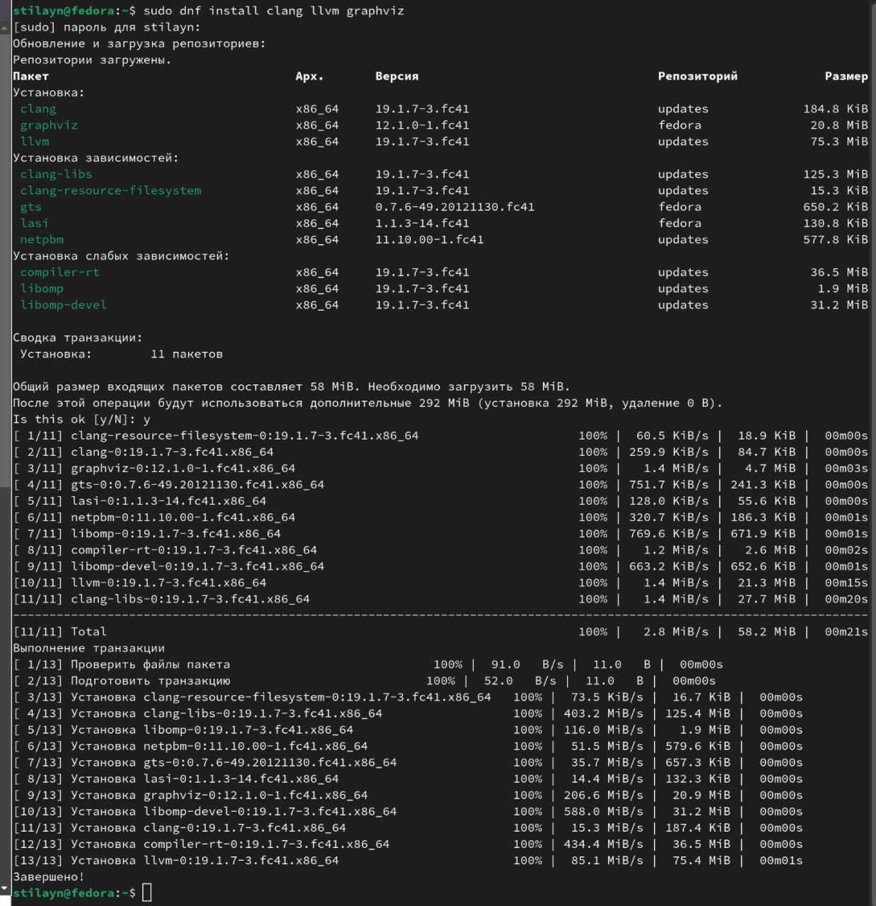
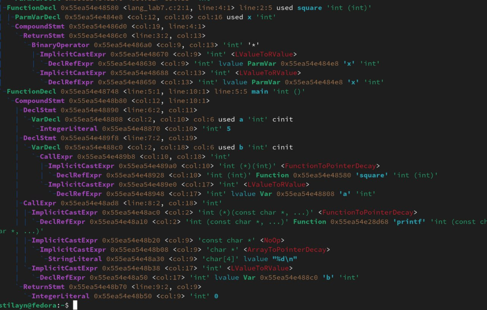
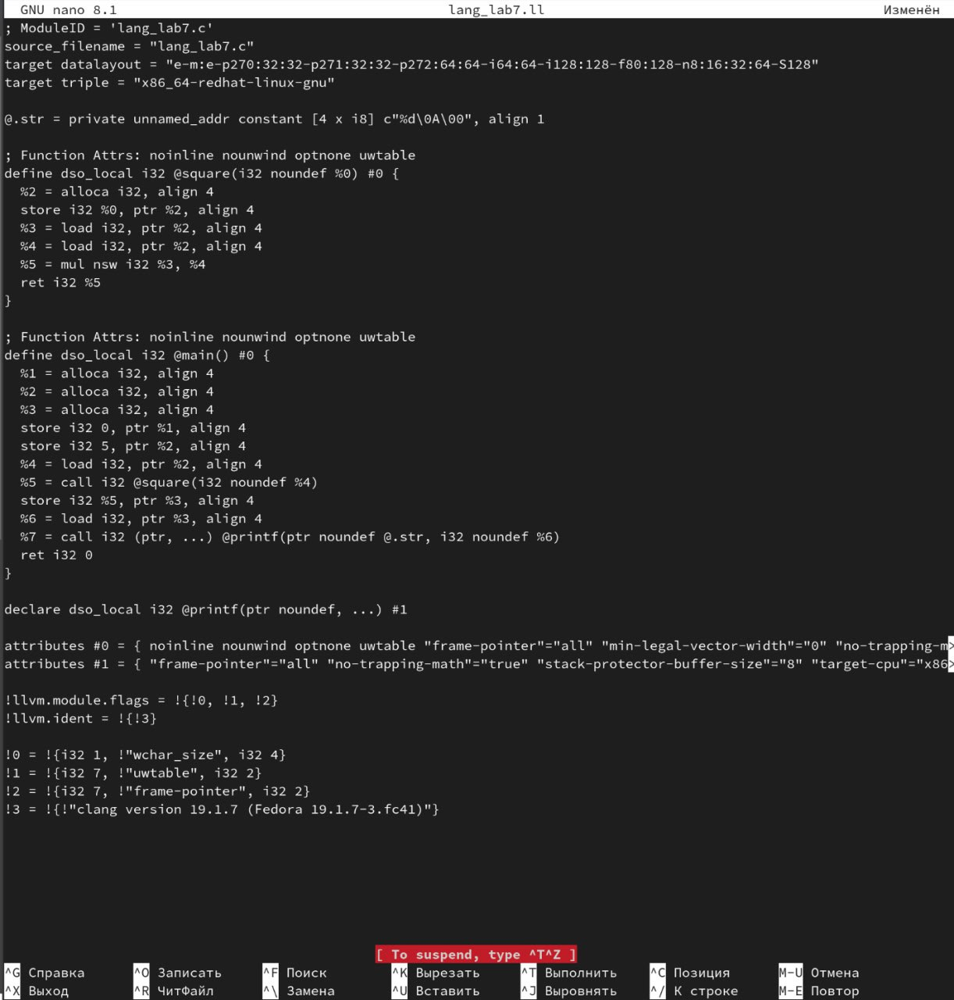
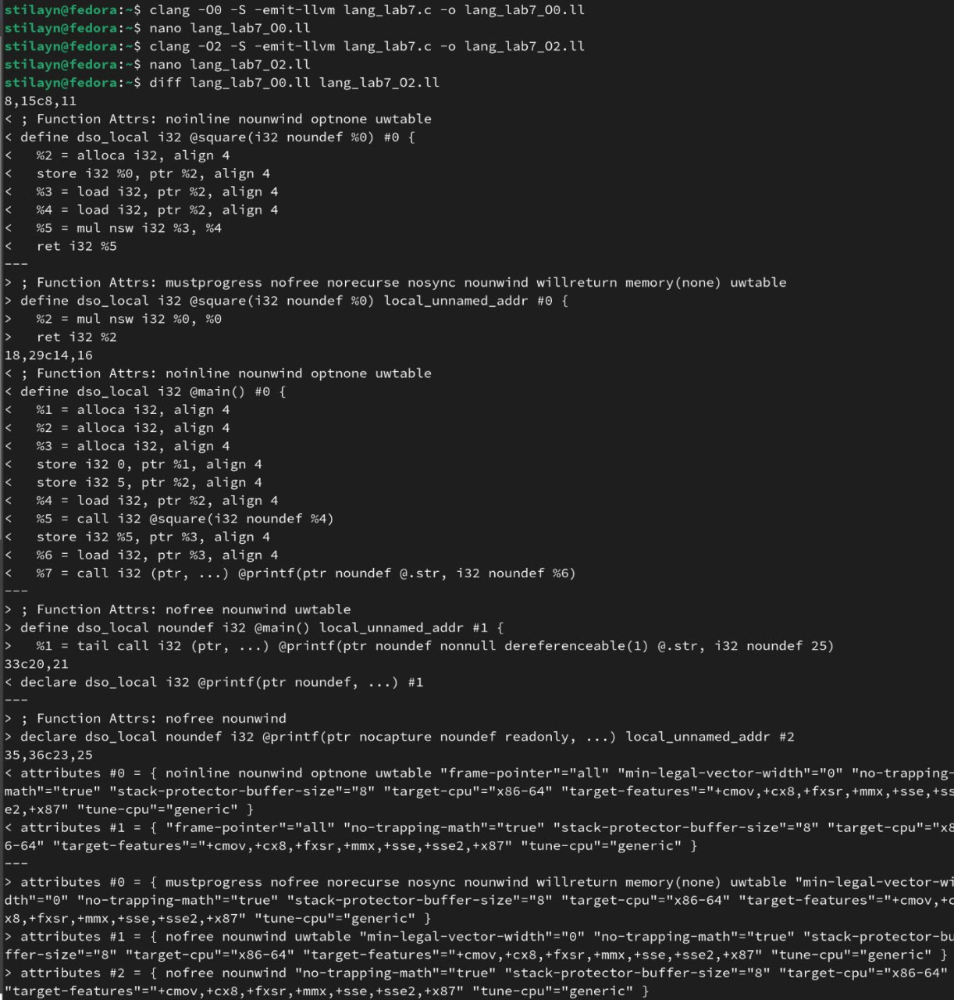
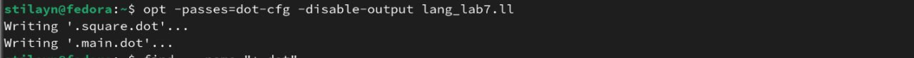
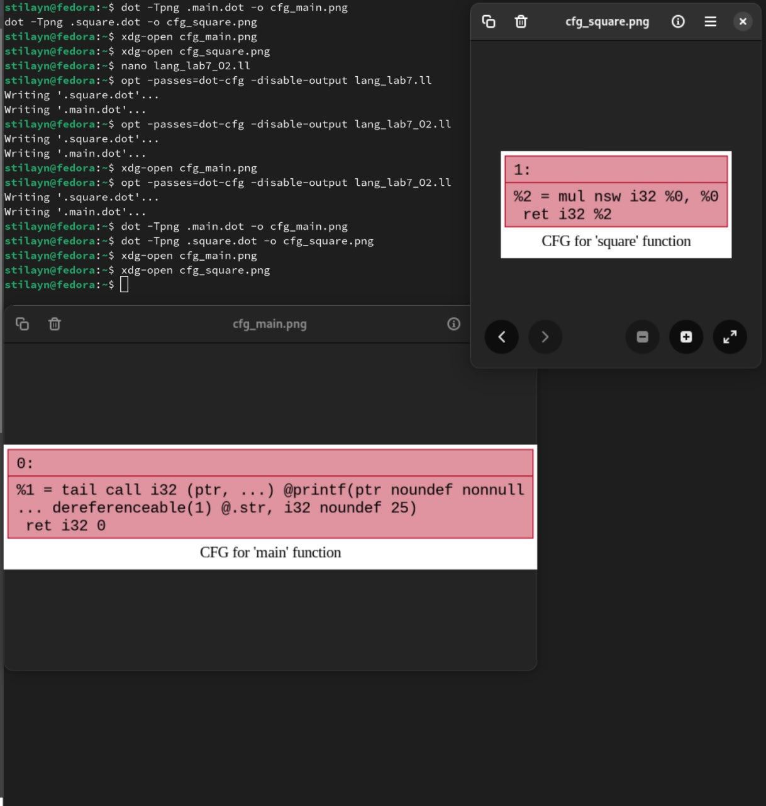
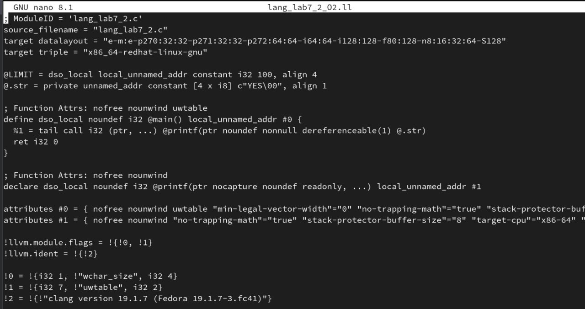
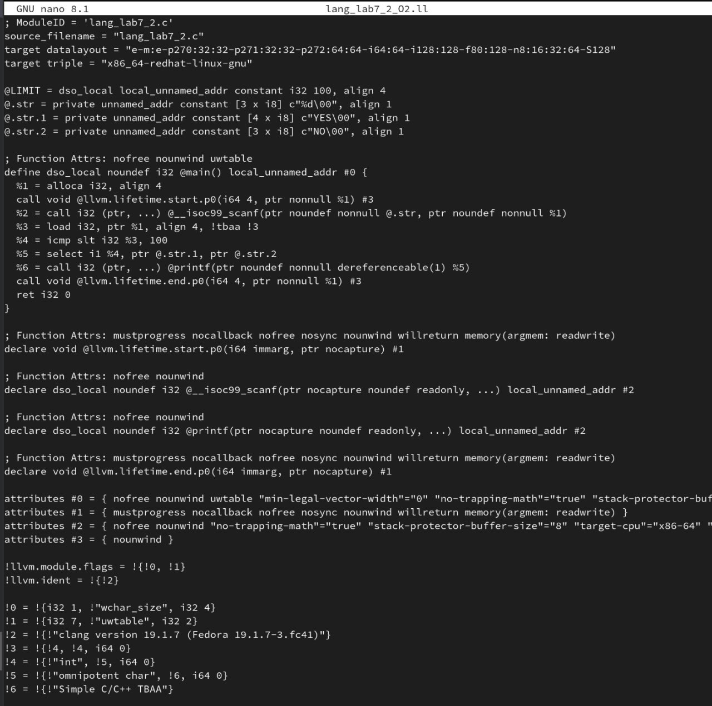

# Лабораторная работа 7

## Содержание
1. [Задание на лабораторную работу](#задание-на-лабораторную-работу)
2. [Ход работы](#ход-работы)  
   2.1. [Установка и подготовка среды](#1-установка-и-подготовка-среды)  
   2.2. [Исходный код](#2-исходный-код)  
   2.3. [Получение AST](#3-получение-ast)  
   2.4. [Генерация LLVM IR](#4-генерация-llvm-ir)  
   2.5. [Оптимизация IR](#5-оптимизация-ir)  
   2.6. [Граф потока управления программы](#6-граф-потока-управления-программы)  
3. [Выводы по работе](#выводы-по-работе)  
4. [Дополнительное задание](#дополнительное-задание)  
   4.1. [Исходный код анализируемых программ](#исходный-код-анализируемых-программ)  
   4.2. [Генерация LLVM IR](#генерация-llvm-ir-1)  
   4.3. [Вывод по дополнительному заданию](#вывод-по-дополнительному-заданию)
5. [Ответы на контрольные вопросы](#ответы-на-контрольные-вопросы)  
   5.1. [Вопрос 1: Clang](#1-что-такое-clang-и-какова-его-роль-в-процессе-компиляции-программ)  
   5.2. [Вопрос 2: LLVM](#2-что-представляет-собой-llvm-и-как-он-используется-в-современных-компиляторах)  
   5.3. [Вопрос 3: AST vs IR](#3-чем-отличается-абстрактное-синтаксическое-дерево-ast-от-промежуточного-представления-llvm-ir)  
   5.4. [Вопрос 4: Промежуточное представление](#4-для-чего-необходимо-промежуточное-представление-ir-в-процессе-компиляции)  
   5.5. [Вопрос 5: Инструкция alloca](#5-что-делает-инструкция-alloca-в-llvm-ir-и-зачем-она-используется-в-функциях)  
   5.6. [Вопрос 6: Оптимизация кода](#6-зачем-нужна-оптимизация-кода-в-компиляторе-и-какие-основные-цели-она-преследует)  
   5.7. [Вопрос 7: SSA-форма](#7-что-такое-ssa-форма-и-почему-она-важна-при-оптимизации-программ)  
   5.8. [Вопрос 8: Граф потока управления](#8-что-такое-граф-потока-управления-cfg-и-как-он-помогает-анализировать-поведение-программы)  
   5.9. [Вопрос 9: Арифметические операции в IR](#9-как-устроено-представление-арифметических-операций-в-llvm-ir-например-умножение-сложение)  
   5.10. [Вопрос 10: Функции в LLVM IR](#10-почему-функции-в-llvm-ir-обычно-представляют-собой-отдельные-единицы-анализа-и-оптимизации)  
   5.11. [Вопрос 11: Инлайнинг функций](#11-что-происходит-с-функцией-в-llvm-ir-если-она-вызывается-один-раз-и-очень-короткая)  
   5.12. [Вопрос 12: Преимущества IR и CFG](#12-какие-преимущества-даёт-использование-ir-и-cfg-для-автоматических-оптимизаций-по-сравнению-с-анализом-исходного-текста-на-c)

    

## Задание на лабораторную работу
Тема лабораторной работы: Преобразование и анализ кода с использованием Clang и LLVM.

<b>Цель работы:</b> Познакомиться с инструментами Clang и LLVM, научиться собирать AST и IR-промежуточное представление кода на C/C++, а также извлекать базовую информацию о программе.

### Задание: 

1. Установить Clang и LLVM;

2. Скомпилировать простой C-файл с использованием clang и получить его: абстрактное синтаксическое дерево (AST), промежуточное представление LLVM IR;

3. Использовать opt для применения базовой комплексной оптимизации (например, О2);

4. Построить граф потока управления (CFG) для оптимизированной программы;

5. Проанализировать результат, сделать выводы и ответить на контрольные вопросы.

## Ход работы
### 1. Установка и подготовка среды
Установлены следующие инструменты в среде Fedora 41
- `clang` — компилятор языка C/C++;
- `llvm` — инструменты анализа и оптимизации кода;
- `opt` — инструмент для работы с LLVM IR и применения оптимизаций;
- `Graphviz` — инструмент для визуализации кода.  

**Команда:**
```bash
sudo dnf install clang llvm graphviz
```
<div align="center">
  
  <br>
  <strong>Рис. 1:</strong> Установка инструментов
</div>

### 2. Исходный код
```C
#include <stdio.h>
int square(int x) {
 return x * x;
}
int main() {
 int a = 5;
 int b = square(a);
 printf("%d\n", b);
 return 0;
}
```

### 3. Получение AST
**Команда:**
```bash
clang -Xclang -ast-dump -fsyntax-only lang_lab7.c
```
<div align="center">
  
  <br>
  <strong>Рис. 2:</strong> Код построенного абстрактного синтаксического дерева
</div>
<br>

**Основные элементы:**
- Узел `FunctionDecl` для square с параметром x и main без параметров.

- Узел `BinaryOperator` для операции x * x.

- Узел `CallExpr` для вызова square(a) в функции main.

**Вывод:**
AST точно отражает структуру программы, включая объявления функций и операций.

### 4. Генерация LLVM IR
**Команда:**
```bash
clang -S -emit-llvm lang_lab7.c -o lang_lab7.ll
```
<div align="center">
  
  <br>
  <strong>Рис. 3:</strong> Сгенерированный LLVM IR
</div>
<br>

### 5. Оптимизация IR

**Шаг 1: Генерация неоптимизированного IR (O0):**
```bash
clang -O0 -S -emit-llvm lang_lab7.c -o lang_lab7_O0.ll
```
**Шаг 2: Генерация оптимизированного IR (O2):**
```bash
clang -O2 -S -emit-llvm lang_lab7.c -o lang_lab7_O2.ll
```

**Сравнение (diff):**
```bash
diff lang_lab7_O0.ll lang_lab7_O2.ll
```
<div align="center">
  
  <br>
  <strong>Рис. 4:</strong> Сравнение оптимизированного и неоптимизированного варианта
</div>
<br>

**Изменения после оптимизации:**
- Функция `square` встроена в `main` (-inline - оптимизация).

- Константа 25 подставлена напрямую (-constprop - оптимизация).

- Удалены `alloca`, `load`, `store` (-mem2reg, dce - оптимизация).

**Вывод:**
Оптимизации значительно упростили код, устранив избыточные операции.

### 6. Граф потока управления программы
**Шаг 1: Генерация CFG:**

```bash
opt -passes=dot-cfg -disable-output lang_lab7_O2.ll
dot -Tpng .main.dot -o cfg_main.png
dot -Tpng .square.dot -o cfg_square.png
```

<div align="center">
  
  <br>
  <strong>Рис. 5:</strong> Генерация GFG
</div>
<br>

**Шаг 2: Визуализация:**
```bash
xdg-open cfg_main.png
xdg-open cfg_square.png
```
<div align="center">
  
  <br>
  <strong>Рис. 6:</strong> Визуализация GFG
</div>
<br>

**Результат:**

- Граф для `main` содержит один блок (после оптимизации).

- Граф для `square` показывает блок с операцией `mul`.

**Вывод:**
CFG наглядно демонстрирует упрощение потока управления после оптимизаций.

### Выводы по работе
- Clang — обеспечивает глубокий статический анализ кода через AST (Abstract Syntax Tree) и IR (Intermediate Representation), позволяя исследовать структуру программы и семантику на разных уровнях абстракции.

- Оптимизации LLVM (уровень -O2) — агрессивно трансформируют промежуточное представление (IR), устраняя мертвый код, сводя вычисления к константам и упрощая графы выражений для повышения эффективности.

- Граф управления потоком (CFG) — визуализирует логику выполнения программы, отображая базовые блоки и переходы между ними, что критично для анализа доминаторов, обнаружения циклов и оптимизации условий.

## Дополнительное задание

### Задание:
Вариант 5. Объявление целочисленной константы с инициализацией на языке C/C++
**Задание:** Определите const int LIMIT = 100; и используй в условии.
Проверьте, была ли подставлена константа при оптимизации -constprop
или -O2.

### Исходный код анализируемых программ
**Программа 1 Код с заданным значением a**
```C
#include <stdio.h>
const int LIMIT=100;
int main() {
    int a = 20;
    if(a<LIMIT){
        printf("YES");
    } else {
        printf("NO");
    }
    return 0;
}
```
**Программа 2 Код с динамически задаваймым значением a**
```C
#include <stdio.h>
const int LIMIT=100;
int main() {
    int a;
    scanf("%d", &a)
    if(a<LIMIT){
        printf("YES");
    } else {
        printf("NO");
    }
    return 0;
}
```

### Генерация LLVM IR
**Команда:**
```bash
clang -O2 -S -emit-llvm lang_lab7_2.c -o lang_lab7_2_O2.ll
```

**Результат выполнения для программы 1:**
<div align="center">
  
  <br>
  <strong>Рис. 7:</strong> LLVM IR для Программы 1
</div>
<br>

При генерации LLVM IR мы можем увидеть, что в результате оптимизаций компилятор оставил только вызов метода print c указателем на строку "YES", что не показывает подставил ли он константу сразу. Для проверки этого проведеи анализ программы 2. 

**Результат выполнения для программы 2:**
<div align="center">
  
  <br>
  <strong>Рис. 8:</strong> LLVM IR для Программы 2
</div>
<br>

При генерации LLVM IR мы можем увидеть, что в результате оптимизаций компилятор в строке "%4 = icmp slt i32 %3, 100" подставил значение константы вместо указателя на ячейку в памяти

### Вывод по дополнительному заданию
В результате выполнения было проверено, что в результате оптимизации -O2 было подставлено значение константы

## Ответы на контрольные вопросы

### 1. Что такое Clang, и какова его роль в процессе компиляции программ?
Clang — это фронтенд компилятора для языков C, C++, Objective-C и других, часть проекта LLVM. Его роль включает:  
- Лексический и синтаксический анализ исходного кода (включая препроцессинг, обработку макросов).  
- Построение абстрактного синтаксического дерева (AST).  
- Генерацию диагностических сообщений (ошибки, предупреждения).  
- Преобразование AST в промежуточное представление LLVM IR для дальнейших оптимизаций и генерации машинного кода.  

Clang отличается модульностью, высокой скоростью работы и понятными сообщениями об ошибках. Он заменяет традиционные компиляторы (например, GCC) в экосистеме LLVM.

### 2. Что представляет собой LLVM и как он используется в современных компиляторах?

LLVM расшифровывается как Low Level Virtual Machine (Низкоуровневая виртуальная машина). Несмотря на слово "виртуальная машина", LLVM — это модульная инфраструктура для разработки компиляторов

**Компоненты:**

- LLVM IR (Intermediate Representation) — промежуточное представление кода, удобное для анализа и оптимизации,

- оптимизаторы — улучшают производительность и размер кода,

- генератор кода (Code Generator) — преобразует LLVM IR в машинный код для конкретной архитектуры (x86, ARM и т.д.).

Современные компиляторы (в том числе Clang) используют LLVM как бэкенд, чтобы производить высокоэффективный машинный код.

### 3. Чем отличается абстрактное синтаксическое дерево (AST) от промежуточного представления LLVM IR?

- AST:  
  - Сохраняет структуру исходного кода (например, имена переменных, блоки, области видимости).  
  - Зависит от языка программирования (например, для C и C++ AST будет разным).  
  - Используется для семантического анализа (проверка типов, контекстно-зависимых правил).  
- LLVM IR:  
  - Низкоуровневое представление, близкое к машинному коду.  
  - Абстрагировано от исходного языка, но зависит от архитектуры (например, типы данных, размеры).  
  - Использует SSA-форму и оптимизируется независимо от исходного языка.  
  - Линейная структура (последовательность инструкций) вместо древовидной.  

### 4. Для чего необходимо промежуточное представление (IR) в процессе компиляции?

IR (Intermediate Representation) — это промежуточная форма кода, находящаяся между высокоуровневым языком (например, C++) и машинным кодом. В контексте LLVM используется LLVM IR — унифицированное представление, пригодное как для анализа, так и для генерации исполняемого кода.

Зачем оно нужно:

- Абстрагирует детали конкретного языка: на основе одного IR можно создавать компиляторы для множества языков.

- Абстрагирует детали архитектуры: один IR можно скомпилировать в код для x86, ARM, RISC-V и других.

- Упрощает разработку оптимизаторов: не нужно писать оптимизации для каждого языка и каждой архитектуры по отдельности.

- IR легче анализировать, так как он более формальный и упрощённый по сравнению с исходным кодом.
### 5. Что делает инструкция alloca в LLVM IR, и зачем она используется в функциях?
- alloca выделяет память на стеке функции для локальной переменной и возвращает указатель на неё.  
- Пример:
  %ptr = alloca i32        ; Выделяет 4 байта на стеке для типа i32.
  store i32 5, i32* %ptr   ; Сохраняет значение 5 в выделенную память.

**Особенности:**  
  - Память автоматически освобождается при выходе из функции.  
  - Используется, когда переменной требуется адрес (например, для передачи по указателю).  
  - В отличие от malloc, не требует ручного управления памятью.  
  - Может быть оптимизирован LLVM (например, если переменная используется только в регистрах).  

### 6. Зачем нужна оптимизация кода в компиляторе, и какие основные цели она преследует?

Оптимизация улучшает:

- производительность (ускорение выполнения),

- размер кода (меньше места в памяти),

- энергопотребление (актуально для автономных устройств).

### 7. Что такое SSA-форма и почему она важна при оптимизации программ?  
**SSA (Static Single Assignment):**  

  - Каждая переменная определяется только один раз.  
  - Для слияния значений из разных ветвей (например, в условиях if-else) используются phi-функции.  
  - Пример с phi-узлом:  
    %result = phi i32 [%a, %branch1], [%b, %branch2]

**Преимущества:**  
  - Упрощает анализ потоков данных и зависимостей.  
  - Позволяет эффективно применять оптимизации:  
    - Устранение общих подвыражений.  
    - Распространение констант.  
    - Удаление мёртвого кода.  
  - Стандарт для современных компиляторов (LLVM, GCC).

### 8. Что такое граф потока управления (CFG) и как он помогает анализировать поведение программы?

CFG (Control Flow Graph) — это граф, где:
- узлы — блоки кода,

- рёбра — возможные переходы между ними (например, переходы по if/while).

Он используется для анализа ветвлений, поиска мертвого кода, построения SSA и других оптимизаций.

### 9. Как устроено представление арифметических операций в LLVM IR (например, умножение, сложение)? 
**Операции представлены инструкциями с явным указанием типа:**  
  - Целые числа:  
    %sum = add i32 %a, %b      ; Сложение.
    %diff = sub i32 %a, %b     ; Вычитание.
    %prod = mul i32 %a, %b     ; Умножение.
  - Числа с плавающей точкой:  
    %fsum = fadd float %x, %y ; Сложение.
  - Есть версии для signed/unsigned (например, sdiv, udiv для деления).
  
**Правила:**
  - Типы операндов должны строго совпадать.  
  - Результат операции — значение в SSA-форме.

### 10. Почему функции в LLVM IR обычно представляют собой отдельные единицы анализа и оптимизации?

Функции — это естественные единицы изоляции, их легко анализировать и оптимизировать отдельно. 

- Изоляция контекста: Каждая функция имеет собственные переменные, блоки и инструкции. Анализ и оптимизация не затрагивают другие части программы напрямую.

- Упрощение анализа и оптимизации: Компилятор может применять оптимизации локально, не анализируя всю программу. Можно параллелить обработку разных функций.

- Интерпретация как модуля: Функции представляют собой модули, пригодные для повторного использования, встраивания, удаления и т.д.

### 11. Что происходит с функцией в LLVM IR, если она вызывается один раз и очень короткая?
Такая функция обычно инлайнится (её тело вставляется в место вызова).  
**Преимущества:**  
  - Устранение накладных расходов на вызов (сохранение регистров, передача аргументов).  
  - Открываются возможности для дальнейших оптимизаций (например, распространение констант в контексте вызывающего кода).  

### 12. Какие преимущества даёт использование IR и CFG для автоматических оптимизаций по сравнению с анализом исходного текста на C?

Использование IR (Intermediate Representation) и CFG (Control Flow Graph) даёт серьёзные преимущества перед анализом исходного кода на C:
Аббревиатуры:

IR — Intermediate Representation (промежуточное представление),

CFG — Control Flow Graph (граф потока управления).

Преимущества:
- Стандартизация: IR — унифицированный и формально определённый, в отличие от C, где возможны тонкости синтаксиса, макросы и другие усложняющие элементы.

- Низкоуровневость IR: IR ближе к машинному коду, что делает его более пригодным для анализов и трансформаций.

- Явная структура управления: В CFG видно, как передаётся управление в программе, какие ветки возможны, где находятся циклы и условия. Это важно для оптимизаций, вроде удаления мёртвого кода, предсказания ветвлений, и т.д.

- Безопасность и надёжность анализа: IR убирает синтаксические и семантические неоднозначности языка C. Упрощается написание анализаторов и оптимизаторов.
- Универсальность: IR и CFG применимы к любому языку, не только к C.
Это делает LLVM удобной платформой для языков нового поколения.
